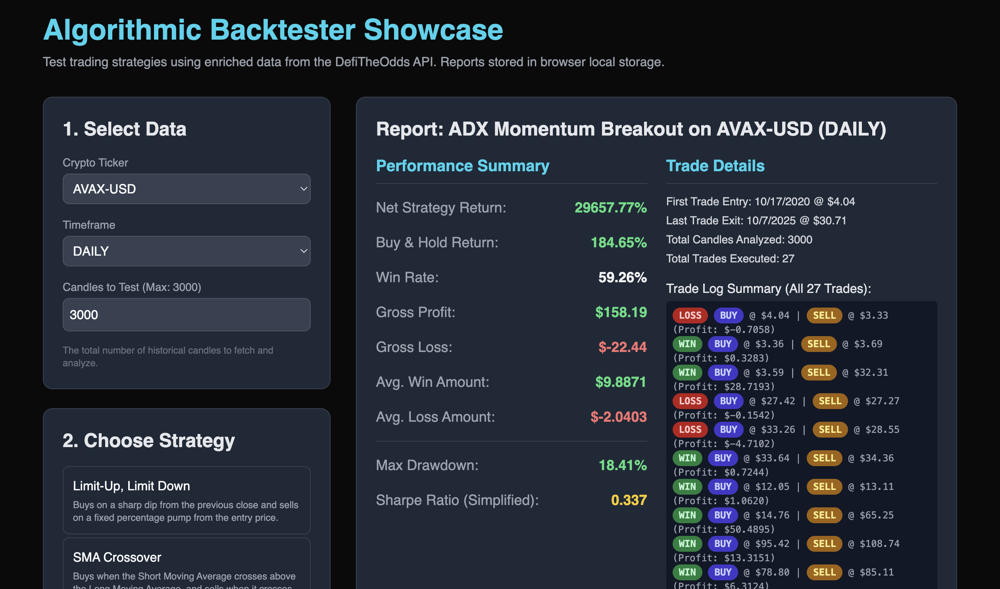

# **DefiTheOdds Showcase App: Strategy Backtesting App **

This is a minimal Node.js and Express application designed to demonstrate how easily developers can integrate the **DefiTheOdds Enriched Crypto Data API** into their projects.

The application fetches crypto price & indicators from the API service (api.defitheodds.xyz) and runs reports for a number of different backtesting strategies

## **🚀 Setup and Installation**

Follow these steps to get the showcase running locally:

### **Prerequisites**

* Node.js (v14 or higher)  
* An active API Key from [DefiTheOdds](https://defitheodds.xyz).

### **Step 1: Clone and Install Dependencies**

1. Navigate to your project directory
2. Install the required packages (Express for the server, node-fetch to query the external API, and dotenv for configuration):  
   npm install

### **Step 2: Configure Your API Key**

The application secures your API key in an environment variable file.

1. **Create .env file:** Rename the provided .env.example file to .env in the project root directory.  
2. **Add Key:** Paste your API key into the file:  
   \# .env  
   API\_KEY="dfo\_YOUR\_KEY\_HERE"

   *(**Note:** You can obtain your API key by logging into the Developer Dashboard at [defitheodds.xyz](https://defitheodds.xyz/dashboard) or by registering at [defitheodds.xyz/register](https://defitheodds.xyz/register).)*

### **Step 3: Run the Application**

Start the Express server:

node server.js

### **Step 4: Access the Chart**

Open your web browser and navigate to:

http://localhost:3001

### **Step 5: Run Backtest**

- Select your desired Crypto Ticker and Timeframe.
- Set the Candles to Test (e.g., 3000 for a long daily test).
- Choose a Strategy from the list (e.g., Limit-Up, Limit Down).
- Configure the Strategy Parameters (e.g., Dip Threshold).
- Click Run Backtest.

The report will populate with metrics derived from the simulated trading activity over the fetched historical data.

## **Project Structure**

| File | Description |
| :---- | :---- |
| server.js | The backend Node/Express server. It handles the secure server-side fetching of data from api.defitheodds.xyz using the X-API-KEY header. |
| public/index.html | Frontend Client: Contains all HTML, CSS, and the JavaScript logic for the backtesting engine, UI, and report generation. |
| package.json | Project dependencies. |
| .env.example | Template for environment variables. |

